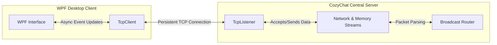

# CozyChat

Establishes real-time, concurrent multi-user communication through a custom TCP-based client-server architecture.

## The Problem

Standard HTTP polling introduces significant latency and overhead for real-time applications. This project addresses the need for instantaneous, bi-directional communication by bypassing higher-level protocols and implementing a direct TCP socket solution. It solves the core complexities of custom packet serialization, multi-threaded connection handling, and continuous data broadcasting in a distributed environment.

## Architecture



## Quickstart

```bash
git clone https://github.com/vwdshka/CozyChatNoUI.git
cd CozyChatNoUI
dotnet build CozyChat.sln

```

## Design Decisions

* **Raw TCP Sockets (`TcpListener` / `TcpClient`):** Chosen over HTTP REST or SignalR to maximize throughput and minimize packet header overhead. Managing raw TCP connections ensures strict, low-level control over the continuous, bi-directional data pipelines required for low-latency messaging.
* **Stream-Based Buffering:** Utilizing a combination of `NetworkStream` and `MemoryStream` guarantees safe packet assembly. Because TCP is a continuous streaming protocol (which can fragment data across packets), the `MemoryStream` acts as a crucial intermediate buffer to completely construct custom network packets before they are deserialized, preventing data corruption or dropped messages.
* **WPF (Windows Presentation Foundation):** Selected for the client application to leverage native hardware acceleration and strict data-binding mechanisms. This ensures the chat interface remains highly responsive and unblocked while background threads seamlessly process continuous network I/O operations.
* **Centralized Broadcast Topology:** The server acts as the single source of truth for all concurrent sessions. By routing all client packets through a central node before stringifying and broadcasting the payload to "online" clients, the architecture prevents client-side state desynchronization and ensures a verifiable communication loop.
